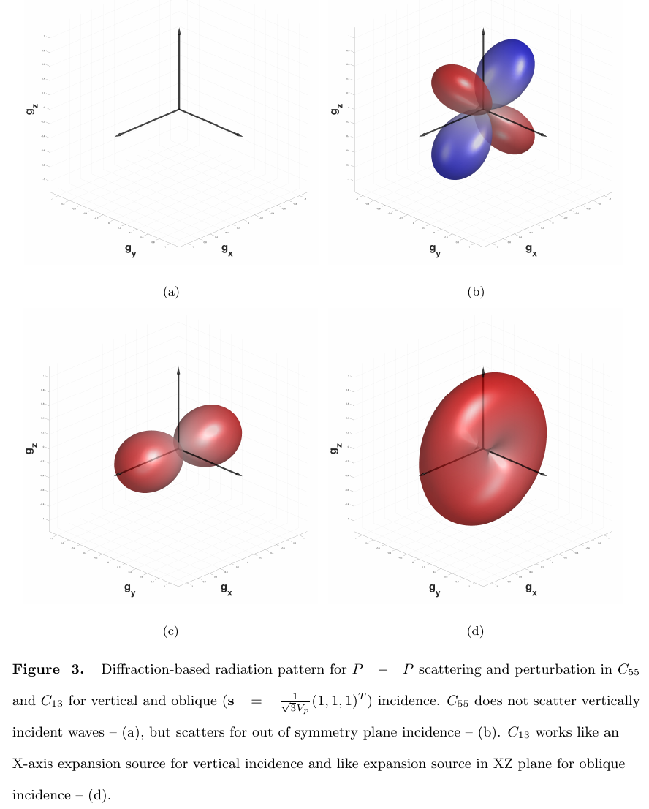

# ScatteringAtlas
Scattering Radiation Pattern Atlas: What anisotropic elastic properties can body waves resolve? 
Kazei &amp; Alkhalifah, 2019 JGR - Solid Earth, https://doi.org/10.1029/2018JB016687
### Reproducing images from the paper in MATLAB
```
cd ScatteringAtlas/scripts
mainCIJ
```
Figures will appear in 
```
ScatteringAtlas/latex/Fig
```
Some functions can be useful as standalone
```
drawPatternsIJ(WT,i,j,path_pattern_save);
```
shows scattering of ```WT``` type (e.g. PP, PSV, SVSH etc.) on perturbation of C<sub>```ij```</sub> element of stiffness matrix and saves eps to ```path_pattern_save```.
```
drawPattern(WT,Cij,denFlag,patternType)
```
draws the radiation pattern of given type in 3D view for preliminarily assembled Cij matrix.

```
simpleRes(Cij, WT, KzMin, KzMax, dKz, phiMax, dPhi, denFlag)
```
computes the resolution in wavenumber azimuth domain.

### Main paper file
```
ScatteringAtlas/latex/CIJ_JGR.tex
```
vladimir.kazei@kaust.edu.sa
